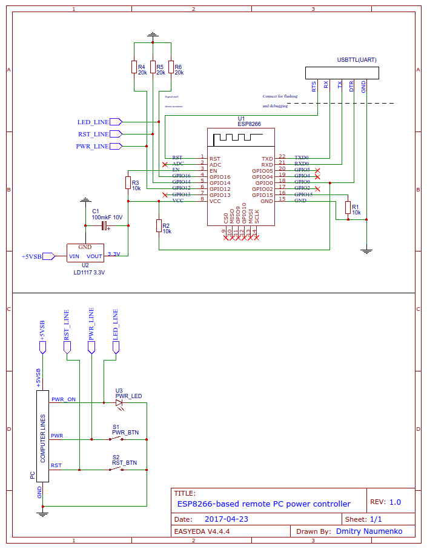
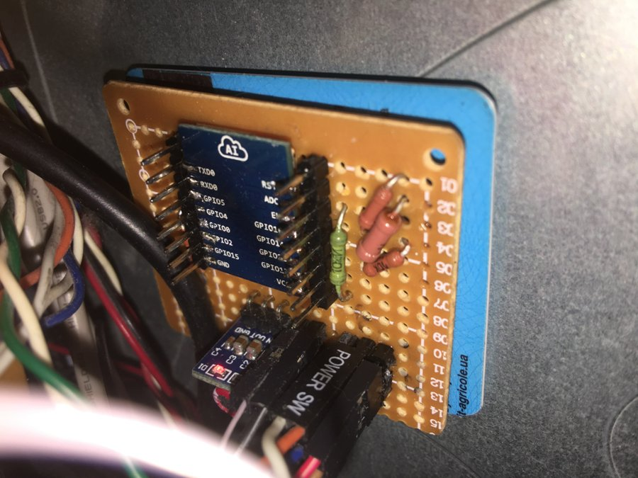

## ESP8266 based PC power controller

This project is super-easy and lightweight Wi-Fi connected ESP8266
board that polls remote server and allows to turn PC power ON and OFF,
reset or perform graceful shutdown.

## The background

To turn PC ON and OFF, all the motherboards have special pins with 3.3V
in normal condition. When a power (PWR) or reset (RST) button on the front
panel of your PC is pressed, the pin gets shortened with ground (GND) and
PC does its work.

All we need to do - add this device in parralel to normal buttons to
be able to short the desired pin on ground programmatically.

Whenever the PC power supply is connected to high voltage, there is a special
`+5VSB` pin that has 5V even when PC is in stand-by. We should use that pin
to power out module.

## Building

You need following electronic componens to build this project:

 - USB to TTL UART Module (CP2102 or FT232RL)
 - ESP8266 module (Personally I used ESP-07, but ESP-08, ESP-12 are similar)
 - LM1117 3.3V 200mA+ Low-Dropout Linear Regulator
 - ESP8266 breadboard adapter (optional, to make soldering easier)
 - Breadboard, wires, jumpers, resitors and capacitors according to the schematic

I did not care too much about the breadbord design, so it is far from perfect
and I would not like to put it here as an example :)

## Flashing

 - Install ESP8266 to Arduino IDE. See [manual](https://github.com/esp8266/Arduino#installing-with-boards-manager)
 - Adjust settings in sources [firmware.ino](src/firmware.ino) - WiFi SSID and password, endpoint URL, intervals, etc.
 - Flash ESP8266 using UART module (google manuals for your board)

## Usage

Install example PHP task server from [php_server](php_server) directory so it is
accesible on the URL you've set in `firmware.ino`.

## Ready device

You can do it better ;)
